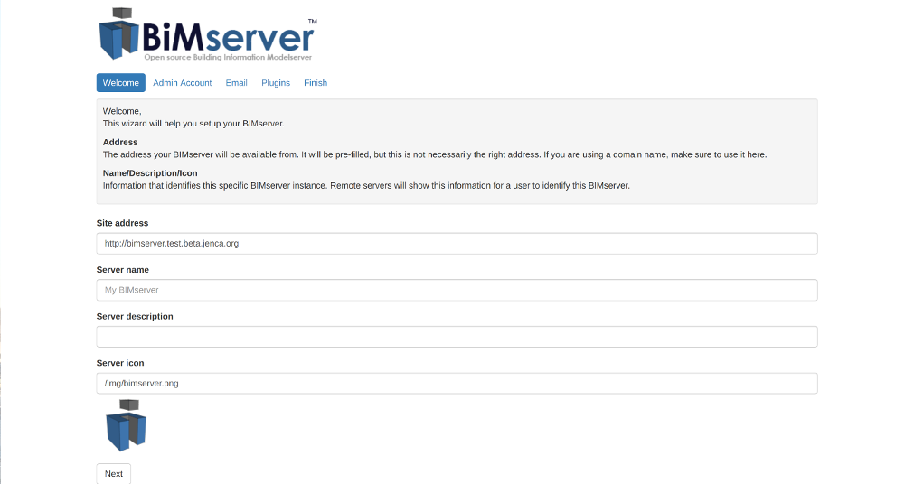

# BIMserver
_BIM platform_

The Building Information Model server (BIMserver) is a Building Information Modelserver accesible on the internet by project team members in order to review and manage federated models in an IFC format for the project.

The platform enables you to create your own ‘BIM Operating System’ and the software core is based on the open standard IFC and therefore knows how to handle IFC data. Core features like merging, modelchecking, fusion, authorisation/authentication, comparing, etc. are available. Everything is based on plugins in an open framework and easy to fine-tune.

## Features:

<ul>a. IFC data model storage</ul>
<ul>b. Model viewer plugin</ul>
<ul>c. Extensive plugin ecosystem</ul>

## How-to:

<ol>1. Launch app on bimcontainer using 'run' button below</ol>
<ol>2. Set up administration login</ol>
<ol>3. Choose from available plugins</ol>
<ol>4. Create project</ol>
<ol>5. Upload file</ol>
<ol>6. Collaborate</ol>

<i>If the GUI is not the preferred interface, the JSON API is exposed through bimcontainer platform at the settings url. [Here](https://github.com/opensourceBIM/BIMserver/wiki/JSON-API) is a good place to start exploring this feature.</i>

